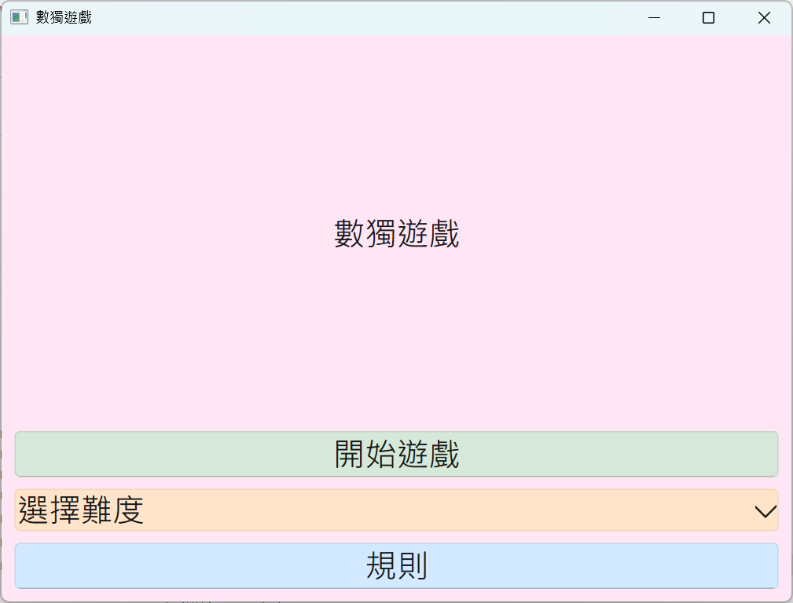

# win01

# 簡易遊戲開發：數獨遊戲

## 專題概述
**目標：** 設計一個基於 Qt 的簡易數獨遊戲，為用戶提供娛樂與腦力挑戰。

### 功能規劃
1. **自動生成數獨題目：**  
   提供三種難度選擇（初級、中級、高級）。  
   - 初級與中級為 9×9 格局。  
   - 高級為 16×16 格局。

2. **答案驗證功能：**  
   檢查玩家是否正確完成題目，即時檢查輸入是否符合數獨規則。

3. **生命值機制：**  
   - 初級：3 次錯誤機會。  
   - 中級：3 次錯誤機會。  
   - 高級：3 次錯誤機會。

4. **遊戲規則顯示：**  
   透過按鈕彈出規則提示框，讓玩家快速了解遊戲玩法。

---

## 專題背景與目的
數獨是一款經典的益智遊戲，能夠提升玩家的邏輯思維與專注力。本專題的目的是開發一款簡單、有趣的數獨遊戲，適合各年齡層玩家。

---

## 技術細節

### 1. UI 界面設計與架構
1. **主介面設計：**  
   - 包含標題 "數獨遊戲"、難度選擇下拉菜單、開始遊戲按鈕與規則按鈕。
   - **標題標籤 (QLabel)：** 顯示遊戲名稱。
   - **開始按鈕 (QPushButton)：** 根據選定難度啟動遊戲。
   - **難度選擇 (QComboBox)：** 讓玩家選擇初級、中級或高級。
   - **規則按鈕 (QPushButton)：** 顯示遊戲規則。

2. **子窗口設計：**
   - 每種難度對應不同的子窗口，分別為 `MainWindow_L` (初級)、`MainWindow_M` (中級) 和 `MainWindow_H` (高級)。
   -**頂部區域** 
     - 顯示生命值狀態。
   -**中部區域**
     - **Qt Widgets** 實現整個數獨遊戲的盤面與按鈕佈局。
     - **QLineEdit** 允許玩家輸入數字。

### 2. 生命值控制
- **生命值設定：** 每次輸入錯誤會扣除一條生命，初始生命值為 3。
- **即時顯示生命狀態：** 當生命值歸零時，遊戲結束並彈出提示框。

### 3. 數獨題目生成與驗證
- **題目生成：**
   - 使用 **亂數 (Random)** 自動生成，並使用 **回朔法 (Backtracking)** 逐步檢查合法性，生成完整的數獨題目後再挖空。
- **答案驗證：**
   - 即時檢查玩家輸入的數字是否符合數獨規則（行、列與宮內唯一）。

### 4. 規則提示框
- 點擊 "規則" 按鈕時彈出提示框，顯示數獨遊戲規則，幫助玩家快速上手。

---

### UI 介面範例圖
#### 主視窗

#### 圖片 1：簡易

#### 圖片 2：中等

#### 圖片 3：困難

### Demo 影片
- https://youtu.be/L_ThbophTlU
