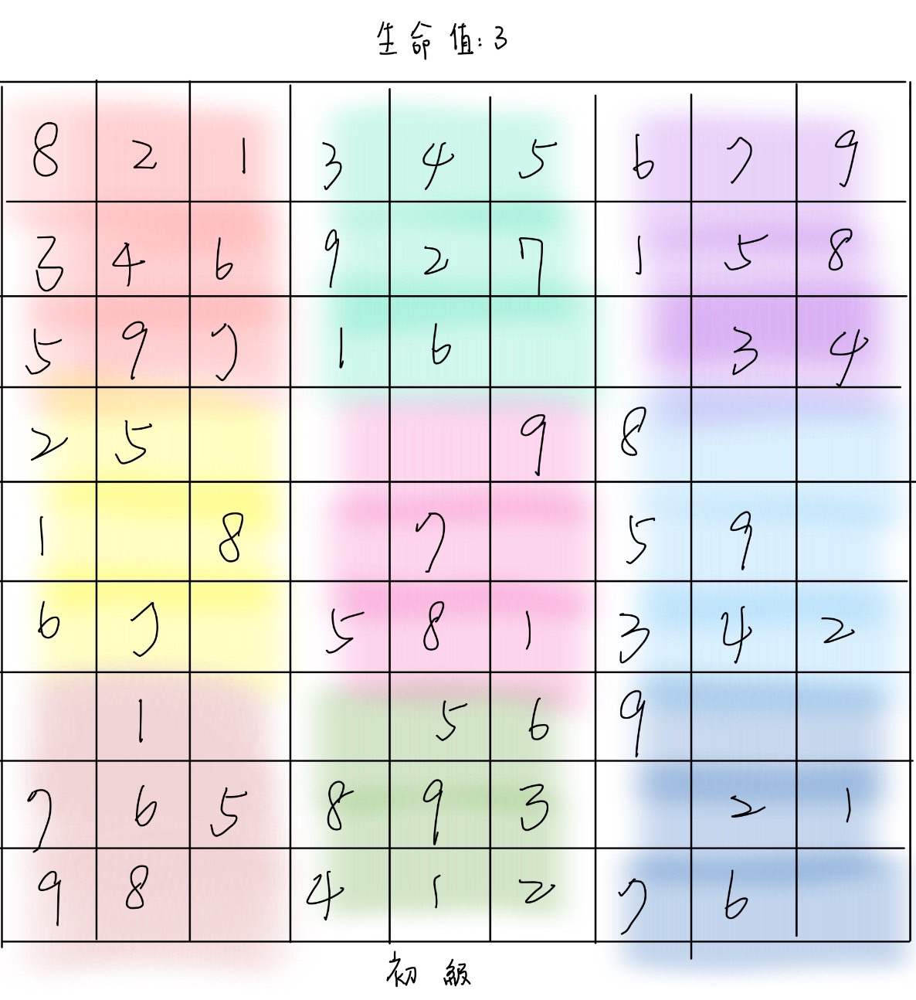
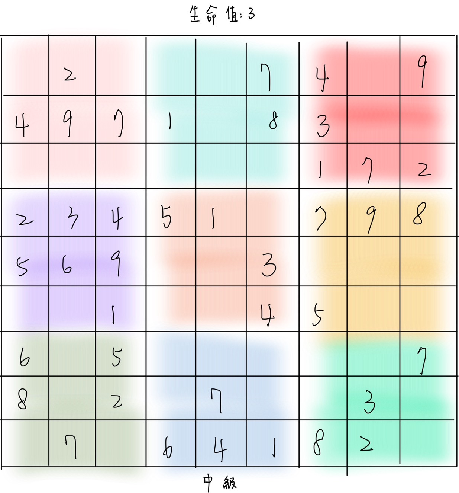

# win01

# 簡易遊戲開發：數獨遊戲

## 專題概述
**目標：** 設計一個基於 Qt 的簡易數獨遊戲，為用戶提供娛樂與腦力挑戰。

### 功能規劃
1. **自動生成數獨題目：**  
   提供多種難度選擇（初級、中級、高級）。  
   - 初級與中級為 9×9 格局。  
   - 高級為 16×16 格局。

2. **答案驗證功能：**  
   檢查玩家是否正確完成題目，即時檢查輸入是否符合數獨規則。

3. **成績追蹤：**  
   - 記錄完成時間與遊玩歷史。  
   - 保存玩家的最佳成績。  

4. **生命值機制：**  
   - 初級：3 次錯誤機會。  
   - 中級：5 次錯誤機會。  
   - 高級：5 次錯誤機會，並附加時間限制。

---

## 專題背景與目的
數獨是一款經典的益智遊戲，能夠提升玩家的邏輯思維與專注力。本專題的目的是開發一款簡單、有趣的數獨遊戲，適合各年齡層玩家。

---

## 技術細節

### 1. UI 界面設計
- **數獨盤面：** 使用 **Qt Widgets** 實現整個數獨遊戲的盤面與按鈕佈局。
  - 每格使用 **QLineEdit**，允許玩家輸入數字。
  - 預填數字以灰色背景標示，避免修改。
- **功能按鈕：** 包括 "檢查答案"、"退出遊戲"等，佈局於盤面下方或側邊。
- **頂部區域：** 顯示計時器與生命值狀態。

### 2. 數獨題目生成與驗證
- **題目生成：** 使用 **回溯法 (Backtracking Algorithm)** 自動生成數獨題目。
- **答案驗證：** 即時檢查玩家輸入是否符合數獨規則（行、列、宮內唯一）。

### 3. 遊玩記錄儲存
- **資料存儲方式：**  
  - 使用本地檔案（如 `.json` 或 `.txt`），儲存玩家的成績（完成時間、難度、遊玩日期等）。 

### 4. 其他細節
- **計時器功能：** 使用 **Qt 的 QTimer** 更新完成時間。
- **生命值控制：** 錯誤輸入時減少生命值，並即時更新 UI 顯示。
- **高級模式時間限制：**  
  - 倒計時功能，時間結束時遊戲自動判定失敗。

---

## UI 架構設計
1. **頂部區域**  
   - 計時器顯示與生命值狀態。  
2. **中部區域**  
   - 數獨盤面（9×9 或 16×16）。  
   - 每格為 **QLineEdit**，不可修改的數字用灰色背景區分。
3. **底部區域**  
   - 功能按鈕，如 "檢查答案"、"提示"、"重新開始"。

---

## 預期成果
- 開發一款可玩性高的數獨遊戲，幫助玩家在娛樂中提升邏輯能力。

### UI 介面範例圖
#### 圖片 1：簡易

#### 圖片 2：中等

#### 圖片 3：困難

